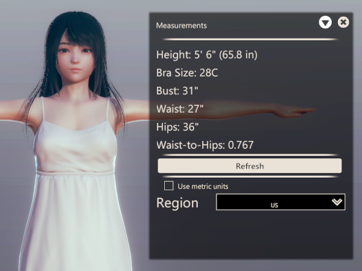

# AI_Measurements

This plugin calculates several real world measurements for a character.

</img>

## Usage

- Make sure the character is in an upright pose. T-Pose is best if available.
- Inside character creation, navigate to *Body* > *Mods* > *Measurements*.
- Click the *Refresh* button.

## Measurements

#### Height

- Calculated as the distance between the *N_Head_top* bone and the origin (0,0,0,).
- Adjusted by the *Height* and *Head size* sliders under *Overall*.

#### Bra Size

Character band and cup sizes.

  
Notes

- Displays for female characters only.
- An extremely thin chest can result in an extremely large cup size.
- The *Direction* slider under *Chest* can have a very large impact on cup size. I generally set it to *0* (or lower) when taking measurements and fix it afterward.

##### Band Size

- Calculated by finding four points at the bust (front, back, left, and right) and assuming they make an ellipse.
- Adjusted by the *Chest Width* and *Chest Thickness* sliders under *Upper Body*.
- Rounds up to the nearest
  - multiple of 5 when using metric units
  - even integer when not using metric units.

##### Cup Size

- Determined by the difference between the exact **bust** and rounded **band** sizes using the configured **region**.

#### Bust

- Calculated as the distance between 6 points:
  - The lats (*N_Back_L* and *N_Back_R*),
  - the nipples (*cf_J_Mune02_L* and *cf_J_Mune02_R*), and
  - 2 side breast points calculated with dark magic.
- Adjusted by most sliders under *Chest* (especially *Size*) and the *Shoulder Width* and *Shoulder Thickness* sliders under *Upper Body*.

  
Notes

- Displays for female characters only.
- Serious about the dark magic bit. Read the code if you don't believe. Here is my best explanation of it:
  - Take a line between *cf_J_Mune02_{L|R}* and *cf_J_Mune_Nip01_{L|R}*.
  - The calculated point will be the same distance from *cf_J_Mune02_{L|R}* as the line's length.
  - Additionaly, a line between the calculated point and *cf_J_Mune02_{L|R}* will form a right angle (to the outer side of the breast) with the first line in the plane that contains both lines.
  - Please don't ask me how the math works. I understood it when I wrote the code and promptly forgot it afterward.

#### Waist

- Calculated by assuming the four waist bones (*N_Waist_f*, *N_Waist_b*, *N_Waist_L*, and *N_Waist_R*) make an ellipse.
- Adjusted by the *Pelvis Width* and *Pelvis Thickness* sliders under *Lower Body*.

  
Notes

- The *Waist* sliders under *Upper Body* do not affect this measurement. While it would be intuitive, the four waist bones correspond to the *Pelvis* sliders, not the *Waist* sliders.

#### Hips

- Calculated as the distance between the 6 *cf_J_Legsk_0x_00 | {1,2,3,5,6,7} ∈ x* bones.
- Adjusted by the *Hips Width* and *Hips Thickness* sliders under *Lower Body*.

  
Notes

- Displays for female characters only.
- Is not currently affected by the *Butt* slider under *Lower Body*.

#### Dick

- Calculated as the distance between *cm_J_dan100_00* (base) and *cm_J_dan109_00* (tip) bones.
- Adjusted by scaling the *cm_J_dan100_00* bone with AIABMX.

  
Notes

- Displays for male and futa characters only.
- If switch from non-futa to futa, you may have to cycle to a different tab and back for this measurement to be displayed.

## Configuration

#### Use metric units

Whether to use metric units (centimeters) or British units (feet and inches).

  
Notes

- Defaults to `false`.

#### Region

Select the appropriate geographic region for bra cup sizes:

| Bust-Band | US     | UK | Europe |
| --------: | -----: | -: | -----: |
| <½"       |     AA | AA |     AA |
| ½-1"      |      A |  A |      A |
| 1-2"      |      B |  B |      B |
| 2-3"      |      C |  C |      C |
| 3-4"      |      D |  D |      D |
| 4-5"      |   DD/E | DD |      E |
| 5-6"      |  DDD/F |  E |      F |
| 6-7"      | DDDD/G |  F |      G |
| 7-8"      |      H | FF |      H |
| 8-9"      |      I |  G |        |
| 9-10"     |      J | GG |        |
| 10-11"    |      K |  H |        |
| 11-12"    |      L | HH |        |
| 12-13"    |      M |  J |        |
| 13-14"    |      N | JJ |        |
| >14"      |      O |  K |        |
